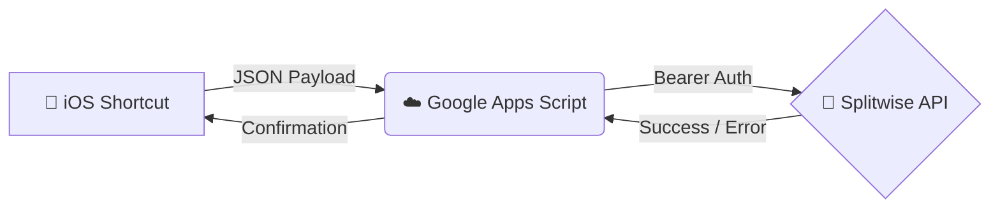

# 💸 TapToSplit

*A powerful, free, and robust bridge between iOS Shortcuts and the Splitwise API.*

---

## ✨ Features

- 🚀 **Zero Cost**: Runs entirely on Google Apps Script (100% free), letting you bypass commercial API limit constraints that exist on platforms like Pipedream.
- 📱 **iOS Shortcuts Native**: Effortlessly log expenses on the go directly from your iPhone with fully customizable Shortcuts.
- 🧮 **Advanced Splitting Math**: Handles `equal` and `split_selected_equally` methods with a custom **"penny-fix"** logic to ensure amounts divide perfectly without throwing Splitwise API errors.
- 🔍 **Fuzzy Group & User Matching**: Don't worry about typing exact names. The script intelligently matches partial names and groups!
- 🔐 **Dynamic API Keys**: API keys are passed securely via the request body, allowing multiple users to invoke the same script with their own varying credentials.
- 💵 **USD Currency Default**: Configured out of the box for handling US Dollars (easily customizable via `CONFIG`).

---

## 🛠️ How it Works

## 🚀 Getting Started

### 1. Deploy the Google Apps Script
1. Go to [script.google.com](https://script.google.com/).
2. Create a new project and paste the entire contents of `google-apps-script.gs`.
3. Click **Deploy** -> **New deployment**.
4. Choose **Web app** as the deployment type.
5. Set "Execute as: **Me**" and "Who has access: **Anyone**".
6. Copy the resulting **Web App URL**.

### 2. Configure Your iOS Shortcut
1. In your iOS Shortcut, set up a "Get contents of URL" action.
2. Method: `POST` (for adding expenses) or `GET` (for fetching active groups/members).
3. URL: Paste your Google Apps Script Web App URL.
4. Add your payload in the **Request Body (JSON)**:
    - `api_key`: Your Splitwise API key
    - `group_name`: Name of the Splitwise group
    - `amount`: The expense cost
    - `description`: What the expense was for
    - `split_method`: `equal` or `split_selected_equally`
    - `selected_people` *(optional)*: Comma separated first names or an array.

---

## 📂 Project Structure

| File | Description |
|------|-------------|
| 📜 `google-apps-script.gs` | **Active Core:** The main Web App script to deploy to Google Apps Script. |
| 🗑️ `process_splitwise_expense.js` | **Deprecated:** Old component originally used for Pipedream. Kept for historical reference only. |

---

   
  
  
  
<i>Start logging expenses like magic!</i>

